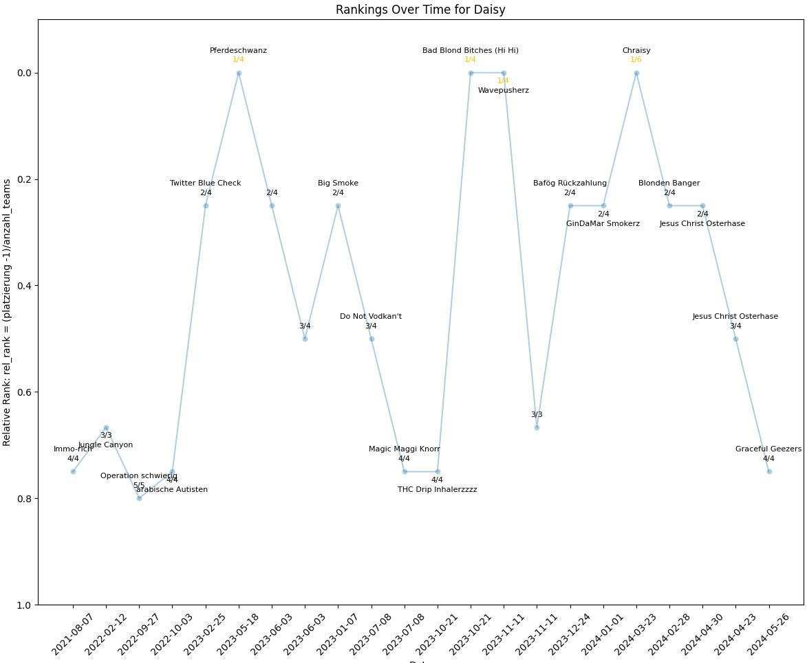

# werfen - how to use functions to see stats

in stats.ipynb run the code blocks in the sections IMPORTS and INIT

Use the functions (with different names possibly) in the section STATS or make use of the following functions:

## Use of Functions

```python
winrate_name = winrate('Name')
``` 

${\color{lightblue}Name}$ must exactly match (including captilization) one of the names in the array players which can be accessed by

```python
players
``` 
${\texttt\color{lightgreen}Function \space Output:}$ (here: winrate_name) list containing:
- dataframe containting teampartners, number of games and wins with them, as well as the resulting winrate playing together
- dataframe containting opponents, number of games and wins against them, as well as the resulting winrate against them
- overall winrate of player (float)
- list of cup_hit_rate each game (only for games on which that metric was recorded)

---

```python
total_games('Name')
``` 
${\color{orange}Name}$ must exactly match (including captilization) one of the names in the array players 

${\color{lightgreen}Function \space Output:}$ total number of games played by 'Name' (int)

---

```python
total_tournaments('Name')
``` 
${\color{orange}Name}$ must exactly match (including captilization) one of the names in the array players 

${\color{lightgreen}Function \space Output:}$ total number of tournaments played by 'Name' (int)

---

```python
fenster_winrate()
``` 
${\color{lightgreen}Function \space Output:}$ overall winrate on the window side (float)

---

```python
ranks('Name')
``` 
${\color{orange}Name}$ must exactly match (including captilization) one of the names in the array players 

${\color{lightgreen}Function \space Output:}$ plot of ranks in tournatment of 'Name's team over time, example:




#   - total_games_all
#   - total_tournaments
#   - fenster_winrate
#   - nemesis
#   - ultimate_nemesis
#   - ranks (barplot)
